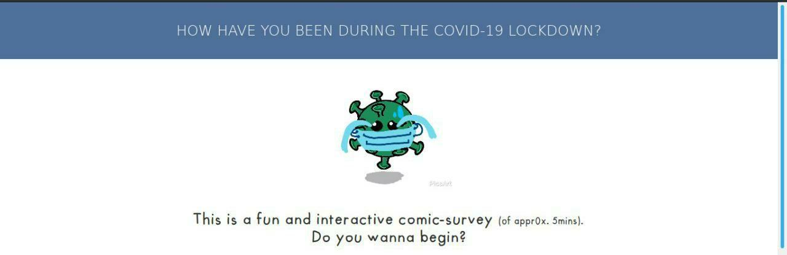

#	PLAY IT HERE: [https://bhorchaj.github.io/How-Have-You-Been-During-COVID-19-Lockdown/](https://bhorchaj.github.io/How-Have-You-Been-During-COVID-19-Lockdown/)

*How Have You Been During COVID-19 Lockdown* is thankful to the many open source resources out there! Here is a full list of music, sounds, and code used:

**Music:** "Recorder and Organ" by Max Piskunov. [Link here](https://soundcloud.com/maxitg)

**Sound Effects:**

* [Buttons](https://www.soundjay.com/button-sounds-1.html) by Sound Jay
* [Drumroll](https://freesound.org/people/adriann/sounds/191718/) by adriann (CC Zero)

**Open Source Libraries:**

* [TWISTED WAVE](https://twistedwave.com/online) for editing audio online

**Font:** [Futura Handwritten](http://www.dafont.com/futurahandwritten.font) by Bill Snyder

**Special Thanks to [Rishav Kundu](https://rishav.io/) for setting up and running the server for data collection**

**To Fork or Download this repo**     
(if you're forking it, be sure to make sure *your* repo is on a branch called `gh-pages`, so that GitHub can automatically generate a webpage for it!)

**If you want to work further on my collected data** Email me/dm with your project idea `ss8659 {{at}} srmist {{dot}} edu {{dot}} in` . I may take a while to respond since I'm away the next couple weeks)

#	"LICENSE"

[MIT License](https://github.com/bhorchaj/How-Have-You-Been-During-COVID-19-Lockdown/blob/master/LICENSE): Permission is hereby granted, free of charge, to any person obtaining a copy of this software and associated documentation files (the "Software"), to deal in the Software without restriction, including without limitation the rights to use, copy, modify, merge, publish, distribute, sublicense, and/or sell copies of the Software, and to permit persons to whom the Software is furnished to do so, subject to a few conditions.

